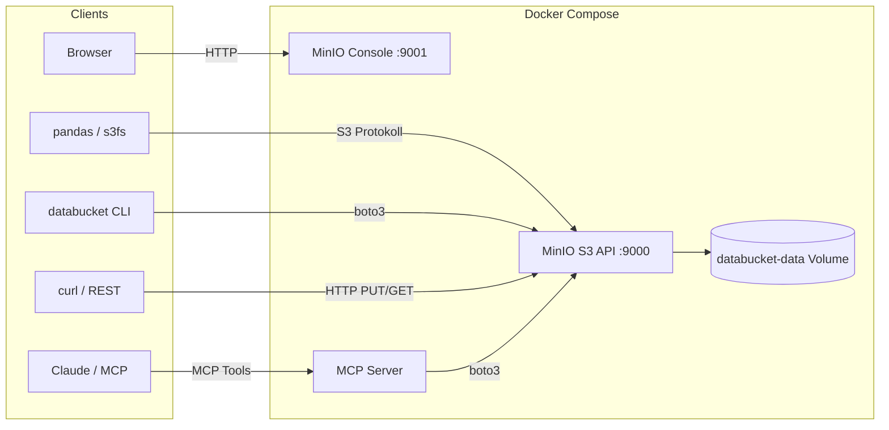

# Databucket — Architektur

## Überblick

Unstrukturierter Datenspeicher auf Basis von MinIO (S3-kompatibel). Ausgelegt für TB-Scale, deployed via Docker.



## Komponenten

### MinIO (Storage)

| Eigenschaft | Wert |
|-------------|------|
| Typ | S3-kompatibler Object Store |
| Image | `minio/minio:latest` |
| S3 API | Port 9000 |
| Web Console | Port 9001 |
| Daten | Docker Volume `databucket-data` |
| Auth | Access Key + Secret Key |

MinIO ist die einzige Storage-Komponente. Es gibt keine Datenbank, keinen Cache, keinen Message Broker. Dateien werden als S3-Objekte gespeichert, organisiert in Buckets mit Pfadstruktur.

### MCP Server (AI-Zugang)

| Eigenschaft | Wert |
|-------------|------|
| Sprache | Python 3.12 |
| Framework | `mcp[cli]` (FastMCP) |
| S3 Client | boto3 |
| Transport | stdio |

Dünner Wrapper um boto3. Stellt 8 Tools bereit:

| Tool | Funktion |
|------|----------|
| `list_buckets` | Alle Buckets auflisten |
| `list_objects` | Objekte in Bucket auflisten (mit Prefix-Filter) |
| `get_object_info` | Metadata + Tags eines Objekts |
| `get_object_text` | Textinhalt lesen (bis 1 MB) |
| `put_object` | Text-Objekt hochladen mit Metadata/Tags |
| `delete_object` | Objekt löschen |
| `create_bucket` | Bucket anlegen |
| `search_by_prefix` | Objekte nach Pfad-Prefix suchen |

### CLI (`databucket`)

| Eigenschaft | Wert |
|-------------|------|
| Datei | `databucket` |
| Sprache | Bash + Python (inline) |
| S3 Client | boto3 |
| Install | `install.sh` → `/usr/local/bin/databucket` |

Befehle:

```
databucket start|stop|status|logs     # Service-Management
databucket update                      # Images aktualisieren & Neustart
databucket bucket list|create|delete   # Bucket-Verwaltung
databucket upload <file> <bucket> <key>
databucket download <bucket> <key> <output>
databucket ls <bucket> [prefix]
```

## Datenmodell

```
Bucket (z.B. "raw")
└── Objekt-Key (z.B. "documents/2026/04/report.pdf")
    ├── Daten (die Datei selbst)
    ├── Metadata (key-value, custom)
    └── Tags (key-value, durchsuchbar)
```

**Buckets** sind die oberste Organisationsebene. Empfohlene Struktur:

```
raw/            ← Originaldaten, unveränderlich
processed/      ← Transformierte/bereinigte Daten
curated/        ← Analysefertige Daten
```

**Objekt-Keys** folgen dem Muster: `<typ>/<jahr>/<monat>/<dateiname>`

**Metadata** wird beim Upload mitgegeben und ist pro Objekt abrufbar.

**Tags** werden beim Upload mitgegeben und sind für Kategorisierung gedacht.

## Zugriffswege

| Weg | Protokoll | Auth | Einsatz |
|-----|-----------|------|---------|
| pandas / s3fs | S3 | Access Key | Datenanalyse |
| boto3 direkt | S3 | Access Key | Automatisierung, Scripts |
| CLI (`databucket`) | S3 (via boto3) | Access Key / Env | Admin, Upload/Download |
| MCP Server | MCP → S3 | Server-intern | Claude, AI-Agenten |
| MinIO Console | HTTP | Root Credentials | Browser-Verwaltung |
| curl / REST | S3 | Signierte Requests | Integration |

## Entscheidungen

| Entscheidung | Gewählt | Alternativen | Begründung |
|--------------|---------|-------------|------------|
| Storage Engine | MinIO | Filesystem + FastAPI | TB-Scale braucht Object Store: Multipart Upload, Checksummen, Millionen Dateien |
| API | S3 (MinIO nativ) | Custom REST API | Kein eigener Code nötig, S3 ist Industriestandard |
| MCP Server | Eigener (boto3) | Keiner | AI-Zugang gewünscht, dünner Wrapper reicht |
| Auth | MinIO Access Keys | OAuth, JWT | Einfach, Token-basiert, pro Client konfigurierbar |
| Deployment | Docker Compose | Kubernetes, Bare Metal | Einzelner Server, kein Orchestrierungsbedarf |

## Backup & Recovery

Das Docker Volume `databucket-data` enthält alle gespeicherten Daten. Empfehlung: Bind-Mount statt Docker Volume verwenden, um den Speicherort explizit zu kontrollieren:

```yaml
# docker-compose.yaml — Bind-Mount Variante
volumes:
  - /srv/databucket:/data   # statt databucket-data:/data
```

Backup-Optionen:

| Methode | Befehl | Eignung |
|---------|--------|---------|
| mc mirror | `mc mirror local/ backup/` | Inkrementelles Backup auf zweiten MinIO oder S3 |
| Filesystem | rsync/Snapshot des Bind-Mount-Verzeichnisses | Einfach, offline |
| Volume Export | `docker run --rm -v databucket-data:/data -v $(pwd):/backup alpine tar czf /backup/databucket.tar.gz /data` | Docker-nativ |

## Grenzen

- **Keine Volltextsuche** über Dateiinhalte. Nur Pfad, Metadata und Tags sind durchsuchbar. Für Volltextsuche: Suchengine (z.B. Meilisearch) nachrüsten.
- **Kein Processing.** Daten werden gespeichert wie geliefert. ETL/Transformation ist Sache der Clients.
- **Single Node.** Kein Cluster, keine Replikation.
- **MCP Server liest nur Text.** Binärdateien (Bilder, PDFs) können über den MCP Server nur als Metadata angezeigt werden, nicht inhaltlich gelesen.
- **MCP Transport ist stdio.** Aktuell nur lokal nutzbar. Für Netzwerk-Zugriff muss auf SSE oder Streamable HTTP umgestellt werden.
