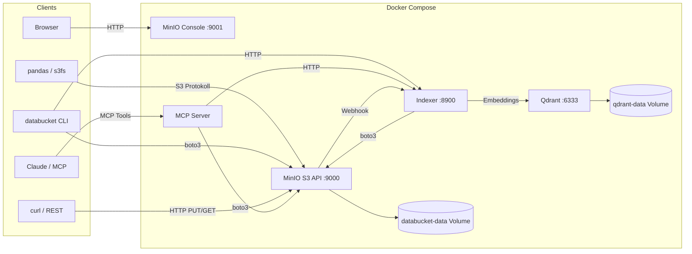

# Databucket — Architektur

## Überblick

Unstrukturierter Datenspeicher auf Basis von MinIO (S3-kompatibel). Ausgelegt für TB-Scale, deployed via Docker.



## Komponenten

### MinIO (Storage)

| Eigenschaft | Wert |
|-------------|------|
| Typ | S3-kompatibler Object Store |
| Image | `minio/minio:latest` |
| S3 API | Port 9000 |
| Web Console | Port 9001 |
| Daten | Docker Volume `databucket-data` |
| Auth | Access Key + Secret Key |

MinIO ist die einzige Storage-Komponente. Es gibt keine Datenbank, keinen Cache, keinen Message Broker. Dateien werden als S3-Objekte gespeichert, organisiert in Buckets mit Pfadstruktur.

### MCP Server (AI-Zugang)

| Eigenschaft | Wert |
|-------------|------|
| Sprache | Python 3.12 |
| Framework | `mcp[cli]` (FastMCP) |
| S3 Client | boto3 |
| Transport | stdio |

Dünner Wrapper um boto3. Stellt 9 Tools bereit:

| Tool | Funktion |
|------|----------|
| `list_buckets` | Alle Buckets auflisten |
| `list_objects` | Objekte in Bucket auflisten (mit Prefix-Filter) |
| `get_object_info` | Metadata + Tags eines Objekts |
| `get_object_text` | Textinhalt lesen (bis 1 MB) |
| `put_object` | Text-Objekt hochladen mit Metadata/Tags |
| `delete_object` | Objekt löschen |
| `create_bucket` | Bucket anlegen |
| `search_by_prefix` | Objekte nach Pfad-Prefix suchen |
| `semantic_search` | KI-Suche über Inhalte (via Indexer/Qdrant) |

### Qdrant (Vector DB)

| Eigenschaft | Wert |
|-------------|------|
| Typ | Vector-Datenbank |
| Image | `qdrant/qdrant:latest` |
| API | Port 6333 (REST + gRPC) |
| Daten | Docker Volume `qdrant-data` |

Speichert Embeddings der indexierten Objekte. Ermöglicht semantische Suche (Similarity Search) über Dateiinhalte.

### Indexer (Semantic Search)

| Eigenschaft | Wert |
|-------------|------|
| Sprache | Python 3.12 |
| Framework | FastAPI + Uvicorn |
| Embedding | `all-MiniLM-L6-v2` (384 Dimensionen, CPU) |
| Port | 8900 |

Empfängt MinIO Webhook-Notifications bei Upload/Delete, extrahiert Text aus Objekten (TXT, CSV, JSON, PDF), erzeugt Embeddings und speichert sie in Qdrant.

| Endpoint | Funktion |
|----------|----------|
| `POST /webhook` | MinIO Bucket Notification Empfänger |
| `POST /search` | Semantische Suche (query, bucket?, limit?) |
| `POST /index/{bucket}` | Manueller Re-Index eines Buckets |
| `GET /health` | Health Check |

Unterstützte Formate: Text, CSV, JSON, PDF (mit PyMuPDF), XML/HTML. Binärdateien werden übersprungen.

### CLI (`databucket`)

| Eigenschaft | Wert |
|-------------|------|
| Datei | `databucket` |
| Sprache | Bash + Python (inline) |
| S3 Client | boto3 |
| Install | `install.sh` → `/usr/local/bin/databucket` |

Befehle:

```
databucket start|stop|status|logs|info   # Service-Management
databucket update                         # Images aktualisieren & Neustart
databucket bucket list|create|delete|info # Bucket-Verwaltung
databucket upload|download|ls|inspect     # Daten-Operationen
databucket search|index                   # Semantische Suche
databucket user list|create|delete|info   # Benutzerverwaltung
databucket user policy|enable|disable     # Zugriffssteuerung
databucket policy list|info               # Policy-Verwaltung
databucket backup [target]                # Vollbackup
```

## Datenmodell

```
Bucket (z.B. "raw")
└── Objekt-Key (z.B. "documents/2026/04/report.pdf")
    ├── Daten (die Datei selbst)
    ├── Metadata (key-value, custom)
    └── Tags (key-value, durchsuchbar)
```

**Buckets** sind die oberste Organisationsebene. Empfohlene Struktur:

```
raw/            ← Originaldaten, unveränderlich
processed/      ← Transformierte/bereinigte Daten
curated/        ← Analysefertige Daten
```

**Objekt-Keys** folgen dem Muster: `<typ>/<jahr>/<monat>/<dateiname>`

**Metadata** wird beim Upload mitgegeben und ist pro Objekt abrufbar.

**Tags** werden beim Upload mitgegeben und sind für Kategorisierung gedacht.

## Zugriffswege

| Weg | Protokoll | Auth | Einsatz |
|-----|-----------|------|---------|
| pandas / s3fs | S3 | Access Key | Datenanalyse |
| boto3 direkt | S3 | Access Key | Automatisierung, Scripts |
| CLI (`databucket`) | S3 (via boto3) | Access Key / Env | Admin, Upload/Download |
| MCP Server | MCP → S3 | Service Account (readwrite) | Claude, AI-Agenten |
| MinIO Console | HTTP | Root Credentials | Browser-Verwaltung |
| curl / REST | S3 | Signierte Requests | Integration |

## Zugriffsmodell

```
Root Account (admin)
├── kann alles: Buckets, Users, Policies
│
├── MCP Service Account (mcp-service)
│   └── readwrite — automatisch vom Installer angelegt
│
├── User: analyst
│   ├── Policy: curated-readonly (custom)
│   └── API Keys: XXXX... (für pandas/Scripts)
│
└── User: importer
    ├── Policy: raw-writeonly (custom)
    └── API Keys: YYYY... (für Import-Scripts)
```

- **Root Account:** Nur für Admin-Operationen (`databucket user`, `databucket policy`)
- **MCP Service Account:** Eigener User mit `readwrite`, nicht Root. Vom Installer angelegt.
- **Benutzer:** Werden via `databucket user create` angelegt, bekommen Policies zugewiesen
- **API Keys:** Pro User generierbar via `databucket user key create`, erben die User-Policy
- **Custom Policies:** Bucket-Level Zugriff via JSON Policy-Dateien

## Entscheidungen

| Entscheidung | Gewählt | Alternativen | Begründung |
|--------------|---------|-------------|------------|
| Storage Engine | MinIO | Filesystem + FastAPI | TB-Scale braucht Object Store: Multipart Upload, Checksummen, Millionen Dateien |
| API | S3 (MinIO nativ) | Custom REST API | Kein eigener Code nötig, S3 ist Industriestandard |
| MCP Server | Eigener (boto3) | Keiner | AI-Zugang gewünscht, dünner Wrapper reicht |
| Auth | MinIO Access Keys | OAuth, JWT | Einfach, Token-basiert, pro Client konfigurierbar |
| Admin API | MinIO Admin API (Python `minio` Paket) | `mc` CLI im Container | Remote-fähig, kein Docker-Exec nötig |
| Deployment | Docker Compose | Kubernetes, Bare Metal | Einzelner Server, kein Orchestrierungsbedarf |

## Testing & CI

### Test-Pyramide

```
┌─────────────────────┐
│    E2E Tests        │  CLI gegen echtes MinIO
│  (test_cli_e2e.py)  │  Bucket/Data/User/Policy/Backup
├─────────────────────┤
│   Unit Tests        │  S3-Operationen gegen MinIO
│(test_mcp_server.py) │  CRUD, Metadata, Tags, Range
└─────────────────────┘
```

### Pipeline

```
Developer                    GitHub Actions
    │                             │
    ├── git push ──────────────►  │
    │   (pre-push hook            ├── Lint (shellcheck, py_compile)
    │    runs all tests locally)  ├── Unit Tests + Coverage
    │                             ├── E2E Tests (MinIO Service Container)
    │                             └── Result ✓/✗
```

### Lokal ausführen

```bash
scripts/test.sh              # nur Unit Tests
scripts/test.sh --e2e        # + E2E Tests
scripts/test.sh --all        # + Coverage Report
scripts/install-hooks.sh     # Pre-Push Hook installieren
```

## Backup & Recovery

Das Docker Volume `databucket-data` enthält alle gespeicherten Daten. Empfehlung: Bind-Mount statt Docker Volume verwenden, um den Speicherort explizit zu kontrollieren:

```yaml
# docker-compose.yaml — Bind-Mount Variante
volumes:
  - /srv/databucket:/data   # statt databucket-data:/data
```

Backup-Optionen:

| Methode | Befehl | Eignung |
|---------|--------|---------|
| mc mirror | `mc mirror local/ backup/` | Inkrementelles Backup auf zweiten MinIO oder S3 |
| Filesystem | rsync/Snapshot des Bind-Mount-Verzeichnisses | Einfach, offline |
| Volume Export | `docker run --rm -v databucket-data:/data -v $(pwd):/backup alpine tar czf /backup/databucket.tar.gz /data` | Docker-nativ |

## Grenzen

- **Kein Processing.** Daten werden gespeichert wie geliefert. ETL/Transformation ist Sache der Clients.
- **Single Node.** Kein Cluster, keine Replikation.
- **Semantic Search ist textbasiert.** Bilder und andere Binärdateien werden nicht indexiert (nur Text, CSV, JSON, PDF).
- **Semantic Search hat kein Access Control.** Die Suche durchsucht alle indexierten Objekte unabhängig von MinIO-Policies. Alle Benutzer mit Zugriff auf die CLI/MCP können Previews aller indexierten Inhalte sehen. Für Szenarien mit strikter Bucket-Isolation muss die Suche um Policy-Checks erweitert werden.
- **MCP Transport ist stdio.** Aktuell nur lokal nutzbar. Für Netzwerk-Zugriff muss auf SSE oder Streamable HTTP umgestellt werden.
